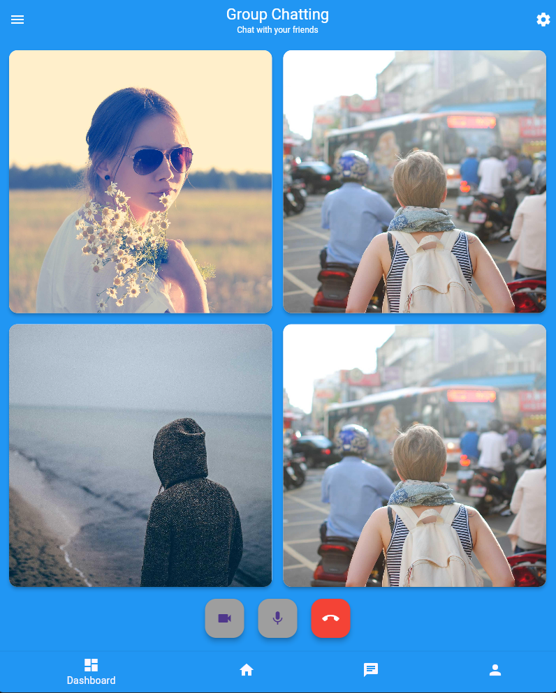

# 💬 Group Chat - Flutter Video Call UI

A modern Flutter interface for group video calls, designed as a university project. Features a clean dashboard with seamless navigation between chat and call interfaces.

<div align="center">
  
</div>

## ✨ Features
- **Video Calls**: Dashboard for managing participants
- **Responsive Design**: Works on mobile, tablet and web
- **Intuitive UI**: Easy navigation between features

## 🛠️ Technologies
- Flutter 3.0+
- Dart 2.17+

## 🚀 Getting Started

### Prerequisites
- Flutter SDK installed ([installation guide](https://flutter.dev/docs/get-started/install))
- IDE (VS Code or Android Studio recommended)

### 💻 Installation
   1. Clone the repository:
   ```bash
   git clone https://github.com/jazjv04/loto-store.git
   cd loto-store
   ```
   
   2. Install dependencies:
 ```bash
    flutter pub get
 ```

   3. Run the app:
 ```bash
    flutter run
 ```
